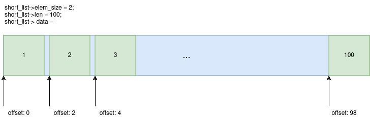
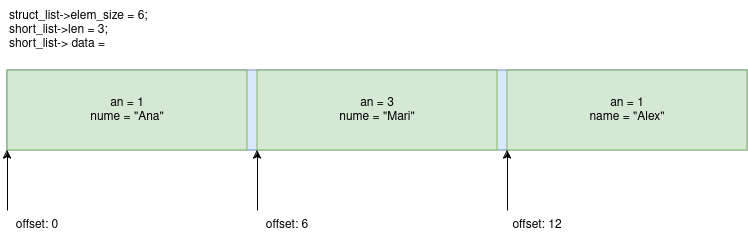

# Funcționale în C

**Deadline soft**: 14 aprilie 2024, 11:55AM

**Deadline hard**: 19 aprilie 2024, 11:55AM

**Responsabili**

* [Robert Grancsa](robert.grancsa2002@gmail.com)
* [Timotei Daraban](darabantimoteisiceva@gmail.com)

## Introducere

Aflând de la studenții de anul 2 de o materie interesantă, [Paradigme de Programare](https://ocw.cs.pub.ro/courses/pp/24/laboratoare/racket/intro), despre care se zvonește că se trece greu, bobocii au devenit interesați de programarea funcțională.
Mai exact, de **[higher-order functions](https://en.wikipedia.org/wiki/Higher-order_function)**, care fac viața mai ușoară programatarilor și care se regăsesc în o multitudine de limbaje populare precum JS, Java, Rust și multe altele.

Aceste funcții (noi le vom numi funcționale) propun o abordare diferită de cea cu care ați fost obișnuiți până acum în programarea imperativă.
Un exemplu potrivit ar fi calcularea sumei numerelor pare înmulțite cu 10:

**Programare imperativă**:

```c
int list[10] = {1, 2, 3, 4, 5, 6, 7, 8, 9, 10};
int result = 0;

for (int i = 0; i < 10; i++)
    if (list[i] % 2 == 0)
        result += list[i] * 10;
```

**Programare funcțională**:

```js
int *result = [1, 2, 3, 4, 5, 6, 7, 8, 9, 10]
               .filter(n => n % 2 == 0)         /* Trece prin lista de numere și le elimină pe cele care nu se împart la 2 */
               .map(a => a * 10)                /* Ia fiecare număr din lista provenită din filtrare, și îl înmulțeste cu 10 */
               .reduce((acc, b) => acc + b, 0); /* Adună fiecare număr într-un acumulator, care este inițializat cu 0 */
```

## Cerință

Tradițional, limbajele funcționale folosesc ca structură de date de bază **lista**, care, poate fi, de la caz la caz, **eterogenă** (reține elemente de tip diferit, ex: Racket) sau **omogenă** (reține elemente de același tip, ex: Haskell).

În cadrul temei, veți simula lucrul cu **liste omogene**, ale căror elemente sunt salvate într-un vector generic:

```C
typedef struct {
    /* Pointer to a contiguous block of memory where the elements of the array are stored */
    void* data;
    /* Size in bytes of a single element of the array */
    int elem_size;
    /* Number of elements in the array */
    int len;
    /* Pointer to a function that frees the memory of a single element of the array, if NULL, no action is taken */
    void (*destructor)(void*);
} array_t;
```

O listă care ar reține numerele de la 1 la 100 ca elemente de tip short ar arăta în felul următor:



O listă care ar reține 3 elemente de tipul

```C
struct __attribute__ ((__packed__)) student_t {
    char an;
    char nume[5];
};
```

ar arăta în felul următor:



> **Atenție**: Reamintim faptul că în cazul structurilor, dimensiunea acestora poate varia în funcție de compilator, arhitectură sau atribute aplicate acestora.
În ceea ce privește exemplul anterior, am folosit `__attribute__ ((__packed__))`, un atribut de tip care elimină padding-ul, de unde rezultă și dimensiunea scăzută a structurii.

Tema vă propune implementarea a patru funcționale, `for_each()`, `map()`, `filter()`, `reduce()`, împreună cu variantele acestora aplicabile pe un număr variabil de parametri, `for_each_multiple()`, `map_multiple()`, `reduce_multiple()`.
De asemenea, va trebui să implementați și o serie de task-uri care să folosească funcționalele create de voi.

> **Atenție**: Implementarea task-urilor fără folosirea de funcționale va conduce la notarea cu 0 a cerinței respective.

### Funcționale simple (30p)

* `void for_each(void (*func)(void*), array_t list)`

    * `for_each()` primește ca prim parametru o funcție cu un singur argument pe care o aplică separat, începând cu indexul 0, pe fiecare element al listei, al doilea parametru al funcționalei.

    * Parametrii funcționalei:

        1. `func`: Funcția cu un singur argument aplicată pe elementele listei.

        1. `list`: Lista care furnizează elemente pe care este aplicată funcția.

    * `for_each()` **nu** modifică structura listei, dar poate modifica valoarea elementelor.

    * Un exemplu de folosire a `for_each()` ar fi pentru a printa elementele unei liste.

* `array_t map(void (*func)(void*, void*), int new_list_elem_size, void (*new_list_destructor)(void*), array_t list)`

    * `map()` creează o nouă listă folosindu-se de funcția și de lista primită ca parametru, începând cu indexul 0 al acesteia.

    * Parametrii funcționalei:

        1. `func`: Funcția cu două argumente, elementul listei noi și elementul listei vechi, care creează elementul listei noi pe baza elementului listei vechi.

        1. `new_list_elem_size`: Dimensiunea elementului listei noi.

        1. `new_list_destructor`: Destructorul pentru noua listă.

        1. `list`: Lista care furnizează elementele pe baza cărora se va crea o nouă listă.

    * `map()` **eliberează memoria consumată de vechea listă** și returnează noua listă creată.

    * Un exemplu de folosire a `map()` ar fi pentru a crea o listă care să rețină doar anii de studiu ai celor 3 studenți din exemplul de mai sus.

* `array_t filter(boolean(*func)(void*), array_t list)`

    * `filter()` creează o nouă listă folosindu-se de elementele din vechea listă care satisfac funcția booleană primită ca parametru, începând cu indexul 0.

    * Parametrii funcționalei:

        1. `func`: Funcția care decide dacă un element va apărea în noua listă.
        Dacă valoarea întoarsă de aceasta este 1, atunci elementul va apărea în noua listă, altfel, nu.

        1. `list`: Lista care furnizează elementele ce vor fi filtrate pentru a crea o nouă listă.

    * `filter()` **eliberează memoria consumată de vechea listă** și returnează noua listă creată.

    * Un exemplu de folosire a `filter()` ar fi pentru a crea o listă care reține doar studenții de anul 1 din exemplul de mai sus.

* `void* reduce(void (*func)(void*, void*), void* acc, array_t list)`

    * `reduce()` parcurge lista și folosindu-se de funcția primită ca parametru, modifică acumulatorul, începând cu indexul 0, pentru ca la final să îl returneze.

    * Parametrii funcționalei:

        1. `func`: Funcția care primește ca prim argument acumulatorul și ca al doilea parametru, elementul curent din listă.

        1. `acc`: Acumulatorul care este modificat pe parcus ce lista este iterată.

        1. `lista`: Lista care furnizează elementele ce vor fi "împăturite" în acumulator.

    * `reduce()` **nu** modifică elementele listei.

    * Un exemplu de folosire a `reduce()` ar fi pentru a calcula suma numerelor de la 1 la 100 din exemplul de mai sus.

### Funcționale cu numărul variabil de parametri (20p)

Pentru a rezolva această categorie de funcționale, veți avea nevoie de cunoștințe în ceea ce privește funcțiile variadice din C.
Astfel, vă recomandăm următoarele resurse:

1. [lab PCLP1](https://ocw.cs.pub.ro/courses/programare/laboratoare/lab13#functii_cu_numar_variabil_de_parametri)

1. [articol GeeksForGeeks](https://www.geeksforgeeks.org/variadic-functions-in-c/)

1. [articol Medium](https://onepunchcoder.medium.com/variadic-functions-explained-fd3b4ab6fd84)

* `void for_each_multiple(void(*func)(void**), int varg_c, ...)`

    * `for_each_multiple()` primește un număr variabil de liste, pe care le parcurge în paralel până la dimensiunea celei mai mici dintre acestea și aplică funcția primită ca parametru pe vectorul format din elementele de la indexul curent din listele parcurse.

    * Parametrii funcționalei:

        1. `func`: Funcția aplicată pe toate elementele de la indexul curent din listele parcurse.

        1. `varg_c`: Numărul de liste de parcurs.

    * `for_each_multiple()` **nu** modifică elementele listelor.

    * Exemplu:

        ```text
        Fie listele:
            [1, 2, 3]
            [1, 2, 3, 4]
            [5, 6, 7, 8]

        Fie funcția f.

        În cadrul `for_each_multiple()` vom aplica f în felul următor:

        Index 0: f([1, 1, 5])
        Index 1: f([2, 2, 6])
        Index 2: f([3, 3, 7])

        Stop, pentru că am ajuns cu indexul la dimensiunea celei mai mici liste, și anume 3.
        ```

* `array_t map_multiple(void(*func)(void*, void**), int new_list_elem_size, void(*new_list_destructor)(void*), int varg_c, ...)`

    * `map_multiple()` primește un număr variabil de liste, pe care le parcurge în paralel până la dimensiunea celei mai mici dintre acestea și aplică funcția primită ca parametru pe vectorul format din elementele de la indexul curent din listele parcurse pentru a crea un nou element ce va fi inserat în lista ce va fi returnată.

    * Parametrii funcționalei:

        1. `func`: Funcția cu două argumente, elementul listei noi și vectorul de elemente din listele vechi, care creează elementul listei noi pe baza vectorului de elemente din listele vechi.

        1. `new_list_elem_size`: Dimensiunea elementului listei noi.

        1. `new_list_destructor`: Destructorul pentru noua listă.

        1. `varg_c`: Numărul de liste de parcurs.

    * `map_multiple()` **eliberează memoria consumată de vechile liste în totalitate** și returnează noua listă creată.

    * Exemplu:

        ```text
        Fie listele:
            [1, 2, 3]
            [1, 2, 3, 4]
            [5, 6, 7, 8]

        Fie funcția f care realizează operația de adunare pe întregi.

        În cadrul `map_multiple()` vom aplica f în felul următor:

        Index 0: f(listă_nouă[0], [1, 1, 5]) => listă_nouă[0] = 7
        Index 1: f(listă_nouă[1], [2, 2, 6]) => listă_nouă[1] = 10
        Index 2: f(listă_nouă[2], [3, 3, 7]) => listă_nouă[0] = 13

        Stop, pentru că am ajuns cu indexul la dimensiunea celei mai mici liste, și anume 3.
        Întoarcem listă_nouă, adică [7, 10, 13]
        ```

* `void* reduce_multiple(void(*func)(void*, void**), void* acc, int varg_c, ...)`

    * `reduce_multiple()` primește un număr variabil de liste, pe care le parcurge în paralel până la dimensiunea celei mai mici dintre acestea și aplică funcția primită ca parametru pe acumulatpr și pe vectorul format din elementele de la indexul curent din listele parcurse pentru a modifica valoarea reținută de acumulator.

    * Parametrii funcționalei:

        1. `func`: Funcția cu două argumente, acumulatorul și vectorul de elemente din liste de la indexul curent, care modifică acumulatorul pe baza vectorului de elemente din liste.

        1. `acc`: Acumulatorul care este modificat pe parcus ce listele sunt iterate.

        1. `varg_c`: Numărul de liste de parcurs.

    * `reduce_multiple()` **nu** modifică elementele listelor.

    * Exemplu:

        ```text
        Fie listele:
            [1, 2, 3]
            [1, 2, 3, 4]
            [5, 6, 7, 8]

        Fie funcția f care realizează operația de adunare pe întregi și adună rezultatul la acumulator.
        Fie valoarea inițială a acumulatorului 0.

        În cadrul `reduce_multiple()` vom aplica f în felul următor:

        Index 0: f(acc, [1, 1, 5]) => acc = 7
        Index 1: f(acc, [2, 2, 6]) => acc = acc + 10 = 17
        Index 2: f(acc, [3, 3, 7]) => acc = acc + 13 = 30

        Stop, pentru că am ajuns cu indexul la dimensiunea celei mai mici liste, și anume 3.
        Întoarcem acc, adică 30.
        ```

### Exerciții (50p)

> **Atenție**: Este obligatorie folosirea funcționalelor implementate la punctele anterioare în rezolvarea acestor task-uri.
În caz contrar, nu veți primi punctajul pe task-ul respectiv.

* `array_t reverse(array_t list)`

    * `reverse()` realizează inversarea unei **liste de întregi**, pe care o salvează într-o listă nouă (cu alte cuvinte, nu este necesar să faceți inversarea in-place).

    * Atât lista primită ca parametru (cea care va fi inversată), cât și lista returnată (inversa) vor fi eliberate de către **caller**.

* `array_t create_number_array(array_t integer_part, array_t fractional_part)`

    * `create_number_array()` creează o listă de `number_t` din două liste de întregi.
    Structura `number_t` reține partea întreagă a unui număr ca int, partea fracționară a unui număr ca int, precum și reprezentarea ca real cu punct a acestuia, reținută ca string.

    *  Listele primite ca parametru vor fi eliberate de **callee**, pe când lista returnată va fi elibarată de către **caller**.

* `array_t get_passing_students_names(array_t list)`

    * `get_passing_students()` creează o listă cu numele studenților care au o notă mai mare sau egală cu 5.0.
    Studentul este reținuți sub forma unei structuri `student_t` care conține numele, vârsta și nota.

    * Lista primită ca parametru (studenții) va fi eliberată de **callee**, pe când lista de nume va fi eliberată de către **caller**.

* `array_t check_bigger_sum(array_t list_list, array_t int_list)`

    * `check_bigger_sum()` creează o listă de booleeni care semnifică dacă lista de întregi de la indexul curent din `list_list` are suma mai mare sau egală cu valoarea salvată la același index din vectorul de sume `int_list`.

    * Listele primite ca parametru vor fi eliberate de către **callee**, pe când lista returnată va fi eliberată de către **caller**.

* `array_t get_even_indexed_strings(array_t list)`

    * `get_even_indexed_strings()` creează o listă cu toate string-urile regăsite la index par din lista primită ca parametru.

    * Lista primită ca parametru va fi eliberată de către **callee**, pe când lista de string-uri de la index par va fi eliberată de către **caller**.

* `array_t generate_square_matrix(int n)`

    * `generate_square_matrix()` creează o matrice de întregi n x n, valorile de pe fiecare linie fiind consecutiv crescătoare începând cu valoarea `număr_linie + 1`.
    Matricea este reprezentată ca o listă de liste de întregi.

    * Exemplu:

        ```text
        Fie dimensiunea matricei n = 3.

        Matricea generată va fi [[1, 2, 3],
                                [2, 3, 4]
                                [3, 4, 5]]
        ```

### Coding style

Coding style-ul poate fi rulat direct din checker, sau folosind comanda
`cs.sh` din folderul `checker/cs`. Punctarea se va face in felul urmator:

- \>= 10 de tipul `CHECK` => -5 puncte
- \>= 5 de tipul `WARNING` => -5 puncte
- \>= 1 de tipul `ERROR` => -10 puncte

## Mentiuni

- Implementarea se face doar in `tasks.c` si `functional.c`
- Este interzis sa folositi variabile globale si/sau statice locale
- Nu aveti voie sa folositi instructiuni repetitive (for/while) in `tasks.c`

## Checker

> ! Atentie, checkerul ruleaza toate testele cu valgrind. Daca aveti erori de
valgrind nu primiti punctajul pe checkerul de pe moodle. Pentru a activa
valgrind-ul pe checker, apasati tasta `v` si apare chenarul rosu.

### Pasi de instalare

Puteti instala checkerul ruland comanda `./install.sh`.
Daca apar orice fel de erori cand rulati comanda, incercati si urmati
urmatorii pasi:

1. Descarcati rustup (ar trebui sa fie independent de platforma)
`curl https://sh.rustup.rs -sSf | sh -s -- -y`. Daca apar erori la
urmatorii pasi, incercati sa adaugati cargo (package managerul de rust) la
PATH, ruland urmatoarea comand `source "$HOME/.cargo/env"`.

2. Rulati urmatoarea comanda ca sa instalati checkerul:
```bash
$ cargo install hw_checker
```

Dupa instalare, puteti rula direct checkerul folosind comanda `hw_checker` din
root-ul temei, sau puteti face un symbolic link la folderul curent.

### Instructiuni checker

Pentru o lista completa de comenzi pentru checker, puteti citi README-ul din
`src/README.md`. Daca aveti probleme cu interfata grafica, puteti rula checkerul
fara interfata grafica, folosind comanda `hw_checker --legacy`
